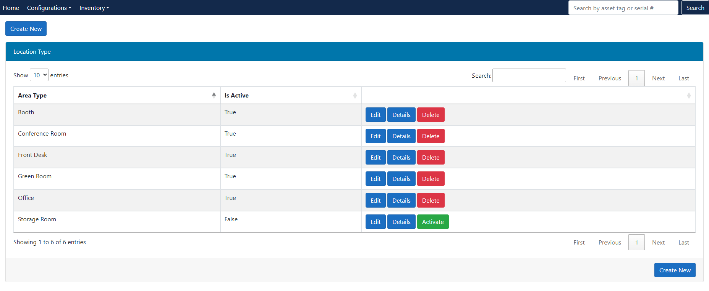
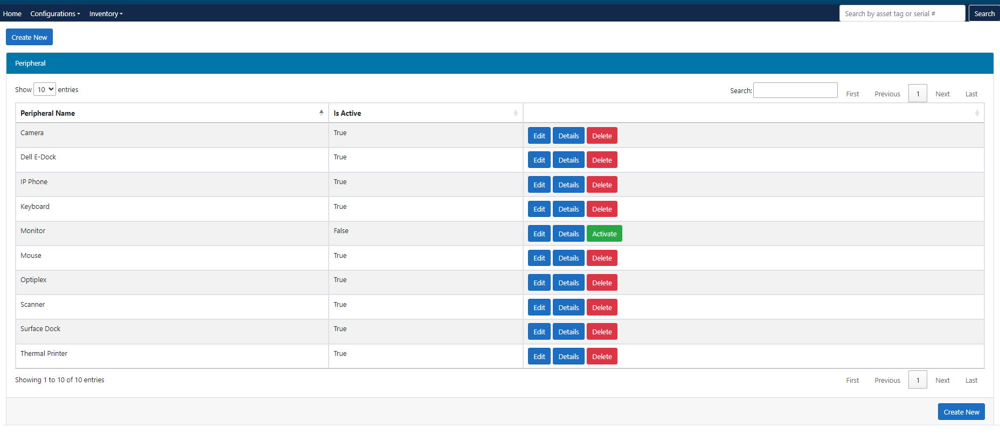
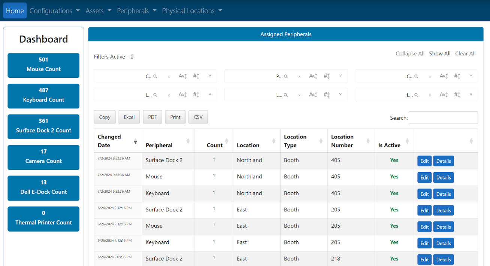

# .NET - Inventory Management Web Application
 
Web application software that stores asset details and location information for an organization. 

## Overview

This is a .NET C# web application designed for inventory management. The application utilizes a SQL database to store and manage inventory data, providing a modern and user-friendly interface for users to interact with the system through easy and quick data entry (with input validation), and configuration pages (with validation) to allow team monitored features. 

## Features

- **User Authentication**: Secure user authentication system to control access to the application.
- **Dashboard**: Overview of current inventory status, count, and other key metrics. There is a inventory by location dashboard, and peripheral equipment count dashboard.
- **Product Management**: Add, edit, and delete products with details such as tag number, make, model, model number, serial number, location, area, room number, po number, status quantity, and price.
- **Reporting**: Generate reports on inventory levels, location counts, and other relevant data.
- **Search and Filters**: Efficiently search and filter products and orders through tag or product serial number.

- ## Technical Features
- **Dynamic View Components**: Rendering view components in dynamically 
- **Input validation**: Using regex and built in model .NET validation as well
- **View Data Tags**
- **Cascading drop downs with search feature**
- **Data Tables with search features**
- **Data validation and duplicate checks with warning tags**

## Technologies Used

- **C#**: The primary programming language for the backend.
- **.NET 6**: Framework for building modern, cloud-based, and internet-connected applications.
- **Entity Framework Core**: Object-relational mapper for interacting with the SQL database.
- **SQL Server**: Database management system for storing and retrieving data.
- **HTML5, CSS, JavaScript**: Frontend technologies for creating an interactive and responsive user interface.
- **Bootstrap**: Frontend framework for designing a clean and consistent user interface.

# More Screen Web Grabs (Example: Create new inventory, datables, dashboards)

